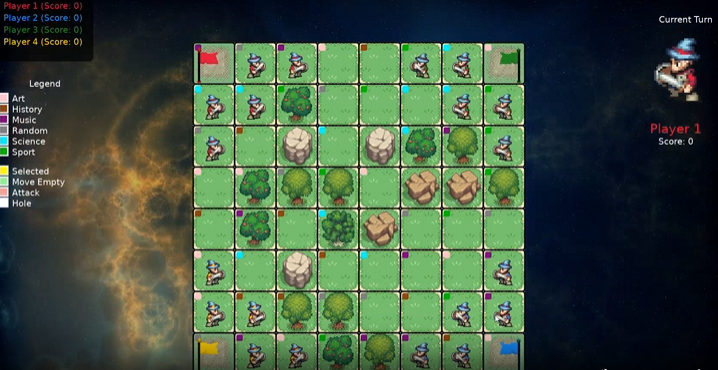

# SRAZ 2026

SRAZ 2026 is a turn-based, trivia-powered capture-the-flag game built in LÖVE. Move your pawns, answer questions under time pressure, and outplay opponents to capture flags or eliminate their pieces.

Read the devlog: https://warped3.substack.com/p/opencode-codex-sraz-2026-game

## Quick Start

Run the game locally with LÖVE 11.x:

```
love .
```

If you are running a packaged EXE, keep `questions.csv` next to the executable.

## How To Play

- Each turn, select one of your pawns and move one tile orthogonally.
- Moving or attacking triggers a trivia question (or multiple, depending on terrain).
- Correct answers allow the action to complete; wrong answers end the turn.
- Capture a flag or eliminate all enemy pawns to win.

## Rules & Trivia Requirements

- **Move into empty tile**: 1 correct answer.
- **Move into tree tile**: 2 correct answers.
- **Attack** (base): 2 correct answers.
- **Attack from a tree tile**: 1 correct answer.
- **Attack a pawn on a tree tile**: 4 correct answers.

If you answer incorrectly at any point, the action fails and the turn passes.

## Tiles & Obstacles

- **Flag tiles**: use the second tile variant from `assets/tiles.png`.
- **Holes**: blocked tiles with rock sprites (`Rock1_1.png`, `Rock5_1.png`, `Rock6_1.png`).
- **Trees**: animated obstacles from `assets/Trees_animation.png`.

Trees are placed on at least 20% of valid tiles (when enabled in the menu).

## Animations

- **Idle**: `assets/idlewalk.png` (first 4 frames, per-pawn phase offset).
- **Walk**: `assets/walk.png`.
- **Attack**: `assets/attack.png` (pre-question).
- **Death**: `assets/middleDeath.png`.
- **Sheath/Draw**: `assets/middleDeath.png` rows/cols (post-move draw).

Attack flows as: attack animation → question(s) → feedback → death (if any) → move → draw.

## Controls

- **Left Click**: select a pawn, choose a target tile, and answer questions.
- **ESC**: back to menu / cancel question (counts as incorrect).

## Menu Options

- Number of players (2–4)
- Time limit per question
- Board size
- Trees on/off
- Music volume
- Play / Load Game

## Saving & Loading

- A `savegame.json` is written while a game is in progress.
- If the game closes mid-session, **Load Game** appears in the menu when a save exists.
- The save stores board layout, pawns, scores, and tree/rock placements.

## Questions CSV

`questions.csv` must be available at runtime. Format per line:

```
Category,Question,Correct,Wrong1,Wrong2,Wrong3
```

Example:

```
Sport,"Which country won the 2022 FIFA World Cup?","Argentina","France","Brazil","Germany"
```

## Build (Windows)

1) Create a `.love` file (exclude `questions.csv` if you want it external):

```
tar -a -c -f sraz.love --exclude=questions.csv .
```

2) Build the EXE by appending the `.love` to `love.exe`:

```
copy /b love.exe+sraz.love Sraz.exe
```

3) Ship `Sraz.exe` alongside these DLLs from the LÖVE zip:

- `SDL2.dll`, `OpenAL32.dll`, `love.dll`, `lua51.dll`, `mpg123.dll`

4) Place `questions.csv` next to the EXE.

## Notes

- Splash video is loaded from `renders/splash.ogv` if present.
- The galaxy shader background uses `shadertoy.mp3` for audio FFT visuals.
